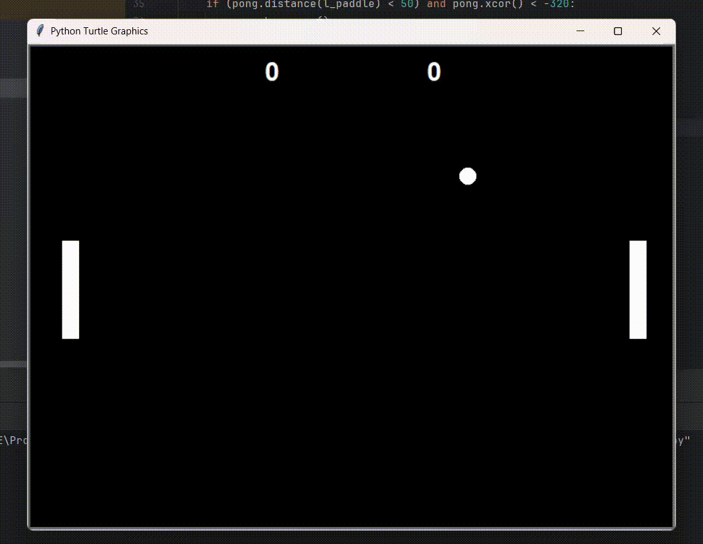

# Py Pong Game 🏓

A classic Pong-style arcade game built with **Python**. Two paddles, a bouncing ball, and simple but engaging gameplay.

---

## Demo / Preview



---

## Table of Contents

- [Features](#features)  
- [Project Structure](#project-structure)  
- [Game Rules](#game-rules)  
- [Installation](#installation)  
- [Running the Game](#running-the-game)  
- [Usage](#usage)  
- [Future Improvements](#future-improvements)  
- [Contributing](#contributing)  
- [License](#license)  

---

## Features

- Two-player mode (one player vs another or player vs computer).  
- Ball bounces off paddles and top/bottom walls.  
- Scoreboard to keep track of points.  
- Increasing difficulty: ball speed or paddle responsiveness can change.  
- Clean, simple visuals and intuitive controls.  

---

## Project Structure

```text
py-pong-game/
├── main.py           # Game entry point
├── pong.py           # Ball logic and bouncing behavior
├── paddle.py         # Paddle class, movement, collision
├── scoreboard.py     # Displays and updates scores
├── game-video.gif    # Demo or preview animation
├── README.md         # Project documentation
└── .gitignore        # Files/folders to ignore in version control
```

---

## Game Rules

- The game begins with the ball positioned in the center, moving in a random direction.  
- Players control paddles on the left and right sides (or one player vs AI).  
- The objective is to hit the ball past the opponent’s paddle.  
- If the ball passes your paddle, the opponent earns a point.  
- First player to reach a predefined score (e.g. 10) wins.  

---

## Installation

Make sure you have **Python 3.x** installed.

1. Clone the repo:  
   ```bash
   git clone https://github.com/ShaileshLambode/py-pong-game.git
   ```

2. Navigate to the project directory:  
   ```bash
   cd py-pong-game
   ```

3. Install any required dependencies (if any). If there are none, you can skip this step.  
   ```bash
   pip install -r requirements.txt
   ```

---

## Running the Game

```bash
python main.py
```

This will start the game window where you can control paddles and play.

---

## Usage

- Use **W / S** keys for left paddle (player 1).  
- Use **Up / Down** arrow keys for right paddle (player 2 or AI).  
- Pause, exit, or restart using keyboard shortcuts (if implemented).  

---

## Future Improvements

- Add sound effects for paddle hits, scoring, game over etc.  
- Add AI difficulty levels.  
- Add menu screen (start, pause, settings).  
- Allow custom settings: score limit, ball speed, paddle size.  
- Add graphical improvements or themes.  

---

## Contributing

Contributions are welcome!  
If you find bugs or have feature requests, please open an issue.  
Feel free to fork the project, make changes, and submit a pull request.

---

## License
